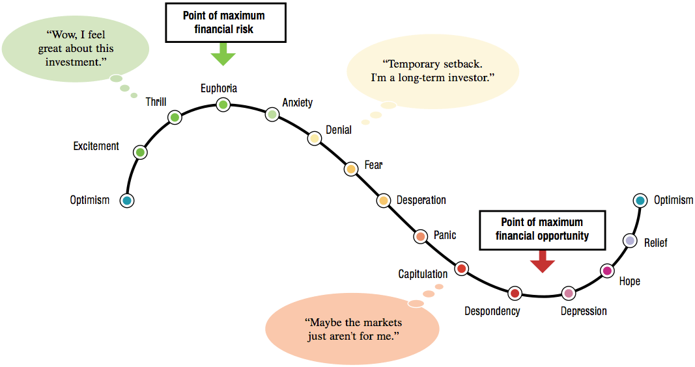

 </img>


[](https://github.com/LeeJungMin723)

[](https://github.com/LeeJungMin723/github-readme-stats)


​

# Hi there 👋
## Hi there 👋
### Hi there 👋
#### Hi there 👋
##### Hi there 👋
---

**두껍게** <br>
*기울임* <br>
~~취소선~~ <br>

* 1번
* 2번
- 1번
- 2번

[네이버](naver.com)

```
print('안녕하세요')
```

:smirk: <br>
:joy: <br>
:rage: <br>

